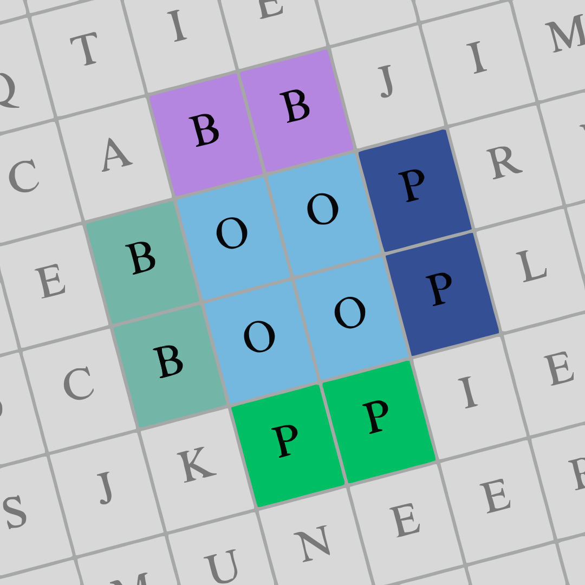

<div align="center">

# BOOP Web

**Word Search Puzzle Generator — From CLI to Cloud**



[](https://github.com/muneer320/BOOP-web/releases)
[](https://github.com/muneer320/BOOP-web/actions)
[](Backend/)
[](frontend/)
[](Backend/)
[](frontend/)
[](LICENSE)

[Live Link](https://boop-web.vercel.app/) · [Report Bug](https://github.com/muneer320/BOOP-web/issues) · [Request Feature](https://github.com/muneer320/BOOP-web/issues)

---

</div>

## Features

### Puzzle Generation
- **Multiple difficulty levels** — Easy, Normal, Hard, Very Hard, Nightmare
- **Bonus modes** — Circular mask puzzles for an extra challenge
- **Custom word lists** — Upload via file or type manually, grouped by topic
- **Custom assets** — Upload cover images, backgrounds, and puzzle backgrounds

### Interactive Play
- **Live word search grid** — Click-and-drag to select words, keyboard navigation
- **Hint system** — Global 30-second cooldown, highlight next unfound word
- **Timer** — Persists across page refreshes, pause/resume
- **Progress persistence** — Save and restore game state via localStorage

### Download & Share
- **PDF puzzle books** — Generate multi-puzzle books with covers and backgrounds
- **Poster download** — Solved grid as a poster-style PNG with word list and solve time
- **Web Share API** — Share solved puzzles via native share sheet with image attachment

### UI/UX
- **Dark mode** — Automatic system preference detection with manual toggle
- **Responsive design** — Works on mobile, tablet, and desktop
- **Live preview** — SVG puzzle preview while configuring
- **Loading states** — Skeleton screens and animated progress indicators
- **Error handling** — Dismissible error banners with clear messages
- **Accessibility** — Keyboard navigation, ARIA labels, focus trapping in modals

## Tech Stack

| Layer | Technology | Purpose |
|-------|-----------|---------|
| **Backend** | [FastAPI](https://fastapi.tiangolo.com/) | REST API framework |
| | [fpdf2](https://pyfpdf.github.io/fpdf2/) | PDF puzzle book generation |
| | [svgwrite](https://github.com/mathiasbynens/svgwrite) | SVG asset rendering |
| | [svglib](https://github.com/deeplook/svglib) | SVG to PDF conversion |
| | [reportlab](https://www.reportlab.com/) | Advanced PDF layout |
| | [slowapi](https://github.com/laurentS/slowapi) | Rate limiting |
| | [Uvicorn](https://www.uvicorn.org/) | ASGI server |
| **Frontend** | [React 19](https://react.dev/) | UI framework |
| | [React Router 6](https://reactrouter.com/) | Client-side routing |
| | [Axios](https://axios-http.com/) | HTTP client |
| | [CSS Modules](https://create-react-app.dev/docs/adding-a-css-modules-stylesheet/) | Component styling |
| **Deployment** | [Vercel](https://vercel.com/) | Frontend hosting |
| | [Hugging Face Spaces](https://huggingface.co/spaces) | Backend hosting (Docker) |
| | [GitHub Actions](https://github.com/features/actions) | CI/CD pipeline |

## Quick Start

### Prerequisites

- [Node.js](https://nodejs.org/) 18+ and npm
- [Python](https://www.python.org/) 3.9+ and pip

### Setup

```bash
# Clone
git clone https://github.com/Muneer320/BOOP-web.git
cd BOOP-web

# Backend
cd Backend
python -m venv venv
source venv/bin/activate   # Windows: venv\Scripts\activate
pip install -r requirements.txt
cd ..

# Frontend
cd frontend
npm install
cd ..
```

### Run

```bash
# Terminal 1 — Backend
cd Backend
uvicorn app:app --reload   # → http://localhost:8000

# Terminal 2 — Frontend
cd frontend
npm start                  # → http://localhost:3000
```

## Project Structure

```text
BOOP-web/
├── Backend/                    # FastAPI backend (deployed to HF Spaces)
│   ├── boop/                   # Core puzzle generation logic
│   │   ├── generatePuzzle.py   # Word search grid algorithm
│   │   ├── appendImage.py      # PDF assembly with assets
│   │   ├── rawWordToJSON.py    # Word-list processing
│   │   └── Assets/             # Cover & background images
│   ├── routers/                # API route modules
│   │   ├── files.py            # File upload/download
│   │   ├── generate.py         # Puzzle book generation
│   │   ├── play.py             # Single-puzzle generation
│   │   ├── settings.py         # App configuration
│   │   ├── status.py           # Health check
│   │   ├── templates.py        # Asset templates
│   │   └── words.py            # Word topics
│   ├── app.py                  # Entry point
│   ├── limiter.py              # Rate limit config
│   ├── requirements.txt        # Python dependencies
│   ├── Dockerfile              # HF Space container definition
│   └── README.md               # Backend API docs
├── frontend/                   # React frontend (deployed to Vercel)
│   ├── src/
│   │   ├── components/         # React components
│   │   ├── context/            # React context providers
│   │   ├── hooks/              # Custom hooks (timer, persistence)
│   │   ├── pages/              # Route pages
│   │   ├── services/           # API client (Axios)
│   │   ├── styles/             # Global CSS & variables
│   │   └── assets/             # Images, icons, fonts
│   ├── public/                 # Static files
│   └── package.json
├── .github/                    # CI/CD & HF metadata
│   ├── workflows/deploy.yml    # GitHub Actions deployment
│   ├── HF_README.md            # HF Space landing page
│   └── HF_gitattributes        # HF Xet binary file config
└── README.md                   # You are here
```

## API Documentation

| Endpoint | Method | Description |
|----------|--------|-------------|
| `/api/status` | GET | Health check |
| `/api/settings` | GET | App configuration limits |
| `/api/templates` | GET | Available cover/background templates |
| `/api/topics` | GET | Word topic categories |
| `/api/topics/{topic}/words` | GET | Words for a specific topic |
| `/api/upload` | POST | Upload file (image or word list) |
| `/api/files/{file_id}` | GET | Retrieve uploaded file |
| `/api/files/{file_id}` | DELETE | Delete uploaded file |
| `/api/generate-puzzle` | POST | Generate a multi-puzzle PDF book |
| `/api/play/generate` | POST | Generate a single playable puzzle |

For full request/response schemas, see the [Backend README](Backend/README.md).

## Deployment

### Automated (GitHub Actions)

Push to `main` triggers the [deploy workflow](.github/workflows/deploy.yml):

- **Backend** — Synced to [Hugging Face Space](https://huggingface.co/spaces/muneer320/BOOP-backend) via Docker
- **Frontend** — Deployed to [Vercel](https://boop-web.vercel.app/)

### Manual

```bash
# Frontend
cd frontend
REACT_APP_API_URL=<backend-url> npm run build
npx vercel --prod

# Backend (Docker)
docker build -t boop-backend Backend/
docker run -p 7860:7860 boop-backend
```

## Environment Variables

| Variable | Default | Required | Description |
|----------|---------|----------|-------------|
| `REACT_APP_API_URL` | — | Yes | Backend API base URL |
| `CORS_ORIGINS` | `http://localhost:3000` | No | Allowed CORS origins (comma-separated) |

## Contributing

1. Fork the repository
2. Create a feature branch (`git checkout -b feature/amazing-feature`)
3. Commit your changes (`git commit -m 'Add amazing feature'`)
4. Push to the branch (`git push origin feature/amazing-feature`)
5. Open a Pull Request

## License

Distributed under the MIT License. See [LICENSE](LICENSE) for more information.

---

<div align="center">

**Built with** ❤️ **by** [Muneer320](https://github.com/muneer320)

[](https://github.com/muneer320/BOOP-web/stargazers)
[](https://github.com/muneer320/BOOP-web/network/members)
[](https://twitter.com/intent/tweet?text=Check%20out%20BOOP%20Web%20-%20a%20word%20search%20puzzle%20generator!&url=https://github.com/muneer320/BOOP-web)

</div>
