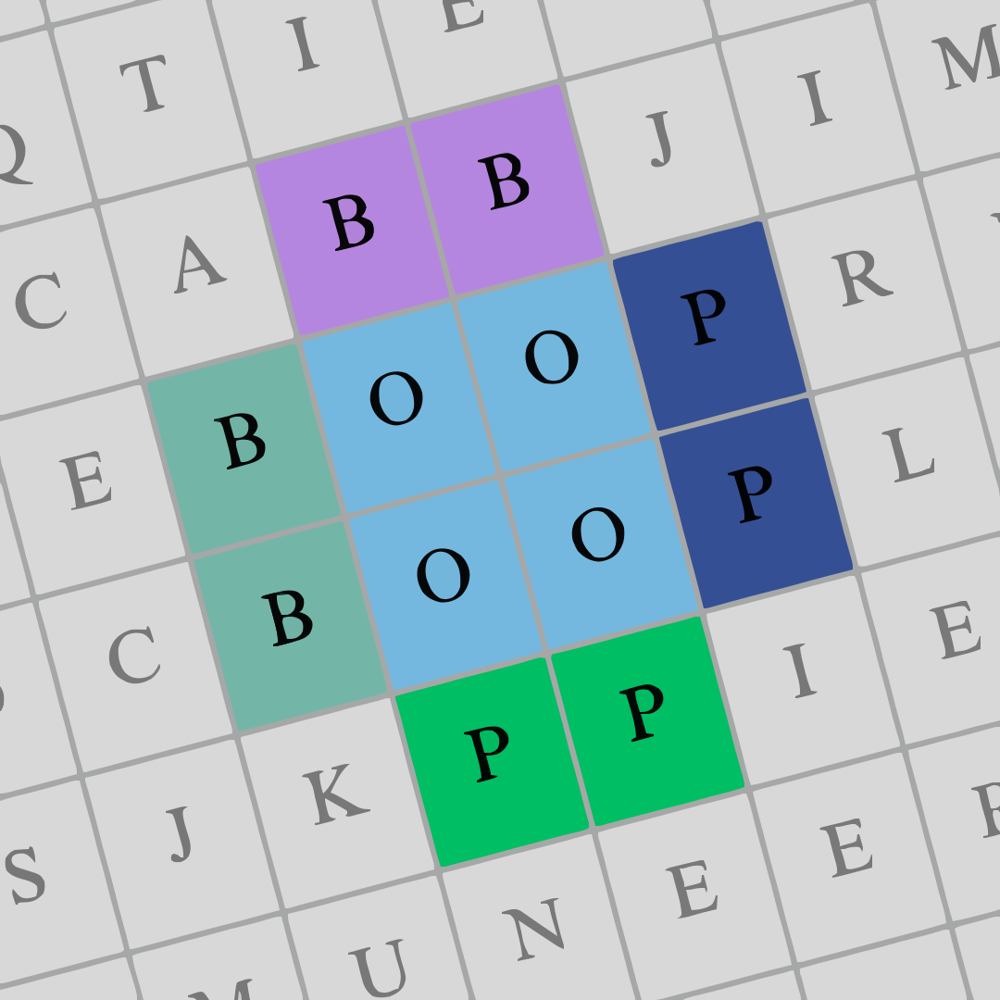
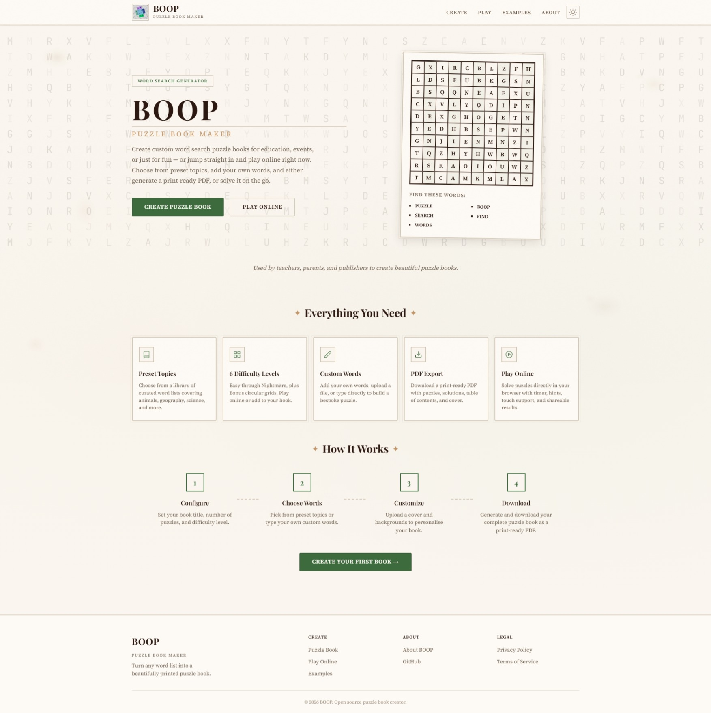
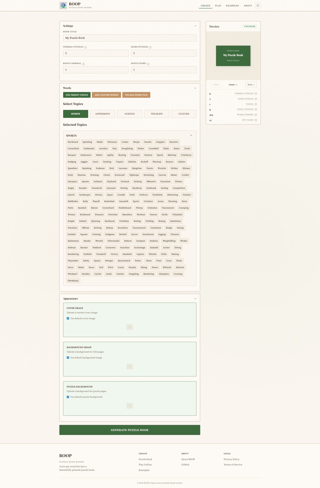
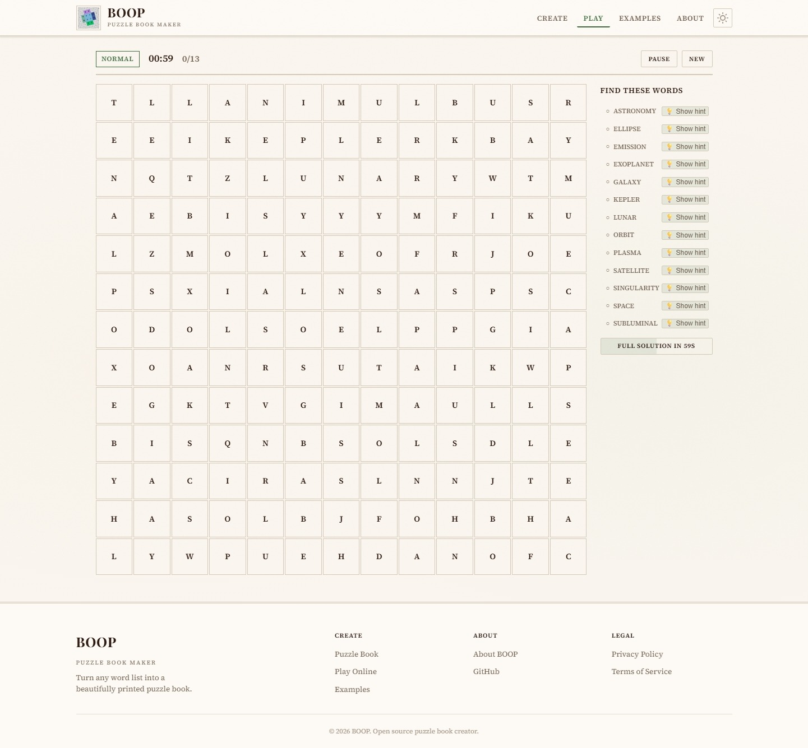

<div align="center">



# BOOP Web

**Make printable word search puzzle books in the browser, or play a puzzle right away.**

[](https://github.com/Muneer320/BOOP-web/actions/workflows/deploy.yml)
[](LICENSE)

[**Open the app**](https://boop-web.vercel.app/) · [Sample books](https://boop-web.vercel.app/examples) · [Report a bug](https://github.com/Muneer320/BOOP-web/issues)

</div>



BOOP started as [a command-line tool](https://github.com/Muneer320/BOOP) that turned word lists into puzzle-book PDFs. BOOP Web puts the same generator behind a web interface: pick topics and words, choose how many puzzles of each kind you want, add your own cover and backgrounds, and download a finished book with a contents page and solutions.

## What it does

**Puzzle books (PDF)**
- Topics from the built-in word lists, your own typed words, or an uploaded `.txt` word list.
- Normal (13×13) and Hard (17×17) puzzles, plus circular "bonus" puzzles for each.
- Cover page, table of contents, a title page per section, and a solutions section.
- Optional custom cover, page background and puzzle background images.
- Progress is shown while the book is generated. If some words cannot be fitted into a grid, the API says which puzzle failed instead of returning a book with a missing page.

**Play in the browser**
- Six modes, from Easy (10×10, forwards only) to Nightmare (20×20), plus a circular Bonus grid.
- Drag or tap to select words, with hints, a timer and progress that survive a page refresh.
- When you finish, download a poster of the solved grid or share it.

**Interface**
- Light and dark themes, responsive layout, keyboard navigation.

| Create a book | Play |
|---|---|
|  |  |

## How it is built

| Part | Stack | Hosted on |
|---|---|---|
| Frontend (`frontend/`) | React 19, React Router 7, Create React App | Vercel |
| Backend (`Backend/`) | FastAPI, svgwrite, svglib + ReportLab, pypdf, slowapi | Hugging Face Spaces (Docker) |

The generator places the words on a grid, draws each puzzle and its solution as SVG, and converts the pages into one PDF. Books are built in a temporary directory per request, so several books can be generated at the same time.

```text
Backend/
  app.py              FastAPI app, CORS and rate limiting
  routers/            generate, play, files, words, settings, templates, status
  boop/               puzzle generator and PDF assembly (from the original CLI)
  tests/              pytest suite
frontend/
  src/components/     pages and UI components
  src/context/        generation progress and theme state
  public/examples/    sample books shown on the Examples page
scripts/              helper for regenerating the Wordo sample book
```

## API

| Method | Path | Purpose |
|---|---|---|
| GET | `/api/status` | Health check |
| GET | `/api/settings` | Grid sizes and word limits used by the generator |
| GET | `/api/topics`, `/api/topics/{topic}/words` | Built-in word lists |
| GET | `/api/templates`, `/api/templates/{id}` | Bundled cover and background images |
| POST | `/api/upload` | Upload an image or a word list. Returns a random file id |
| GET / DELETE | `/api/files/{file_id}` | Fetch or delete one uploaded file by its id |
| POST | `/api/generate-puzzle?session_id=…` | Build a book and return the PDF |
| GET | `/api/generation-progress/{session_id}` | Progress of a book that is being generated |
| POST | `/api/play/generate` | One puzzle for the in-browser game |

Request and response examples are in [Backend/README.md](Backend/README.md).

## Run it locally

You need Python 3.10+ and Node.js 18+.

```bash
git clone https://github.com/Muneer320/BOOP-web.git
cd BOOP-web

# Backend: http://localhost:8000
cd Backend
python -m venv venv
venv/bin/activate          # Windows: venv\Scripts\activate
pip install -r requirements.txt
uvicorn app:app --reload

# Frontend: http://localhost:3000 (in a second terminal)
cd frontend
npm install
npm start
```

The frontend reads the backend address from `REACT_APP_API_URL` (default `http://localhost:8000/api`). The backend reads allowed origins from `CORS_ORIGINS` (comma-separated, default `http://localhost:3000`).

### Tests

```bash
cd Backend && pip install pytest httpx && pytest
cd frontend && npm test
```

## Deployment

Every push to `master` runs the backend tests and then syncs `Backend/` to the Hugging Face Space ([workflow](.github/workflows/deploy.yml)). Vercel builds the frontend from the same branch.

## History

The first web version (April–May 2025) was a small React form around the CLI generator. It is kept as the [`v2.0-before-finishupathon`](https://github.com/Muneer320/BOOP-web/tree/v2.0-before-finishupathon) tag.

In June 2026 I rebuilt most of the app during the Finish-Up-A-Thon hackathon. The work included the redesign, dark mode, the in-browser game, live generation progress, the Examples page and security fixes. Later cleanups made book generation safe to run concurrently, made generation failures report a clear error, shrank the generated PDFs (the Wordo sample went from 26.8 MB to under 0.5 MB) and added tests.

## License

[MIT](LICENSE)
