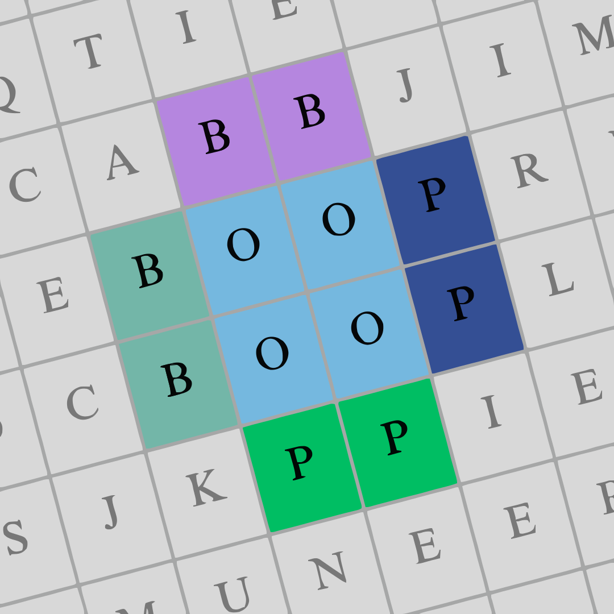
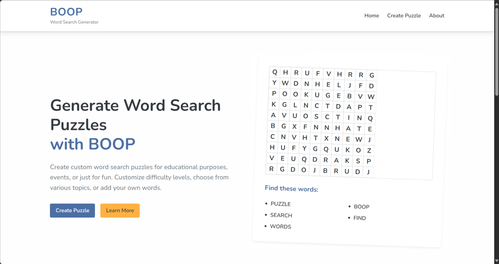

# BOOP Web


BOOP Web is a React-based user interface for the BOOP puzzle generator API. It transforms the [original CLI tool](https://github.com/Muneer320/BOOP) into an accessible web experience, allowing users to configure and generate customizable word search puzzle books easily and conveniently.

## Table of Contents

- [Features](#features)
- [Demo](#demo)
- [Prerequisites](#prerequisites)
- [Installation](#installation)
- [Development](#development)
- [Production Build](#production-build)
- [Configuration](#configuration)
- [Project Structure](#project-structure)
- [API Integration](#api-integration)
- [Testing](#testing)
- [Contributing](#contributing)
- [License](#license)

## Features

- Intuitive form to select number of levels, modes, topics, words, and more.
- Upload custom word lists, covers, and backgrounds
- Download generated PDF puzzle books
- Download progress indicator follows around all pages
- Responsive design for desktop and mobile
- Client-side routing with React Router v6
- File uploads handled with Axios

## Demo



## Prerequisites

- Node.js >= 16.x
- npm >= 8.x or yarn >= 1.x
- Backend API running at `http://localhost:8000` (default proxy)

## Installation

1. Clone the repository:
   ```bash
   git clone https://github.com/Muneer320/BOOP-web.git
   cd BOOP-web/frontend
   ```
2. Install dependencies:
   ```bash
   npm install
   # or
   yarn install
   ```

## Development

Run the development server with hot reloading:

```bash
npm start
# or
yarn start
```

- The app will be available at `http://localhost:3000`.
- API requests under `/api` are proxied to `http://localhost:8000`.

## Production Build

Create an optimized production build:

```bash
npm run build
# or
yarn build
```

The output will be in the `build/` directory. Serve it with any static file server.

## Configuration

- Proxy target: defined in `package.json` (`proxy` field).
- To change API URL, set the `REACT_APP_API_URL` environment variable before build or override in `src/config.js`.

## Project Structure

```
frontend/
├── public/
│   ├── index.html
│   └── favicon.ico
├── src/
│   ├── components/       # Reusable UI components
│   ├── contexts/         # React contexts
│   ├── hooks/            # Custom React hooks
│   ├── services/         # API client (Axios)
│   ├── App.js            # Root component and routes
│   ├── index.js          # Entry point
│   └── setupTests.js     # Jest setup
├── README.md             # This file
└── package.json          # Dependencies & scripts
```

## API Integration

The frontend consumes the BOOP Web API endpoints:

| Endpoint                     | Method | Description                                           |
| ---------------------------- | ------ | ----------------------------------------------------- |
| `/api/status`                | GET    | Health check                                          |
| `/api/settings`              | GET    | Fetch available difficulty, bonuses, masks, grid sizes|
| `/api/templates`             | GET    | List built-in templates                               |
| `/api/upload`                | POST   | Upload custom assets (multipart/form-data)           |
| `/api/generate-puzzle`       | POST   | Generate and download puzzle book PDF                |

Refer to the [Backend README](../Backend/README.md) for full API documentation.

## Testing

Run unit tests with React Testing Library:

```bash
npm test
# or
yarn test
```

## Contributing

Contributions are welcome! Please follow these steps:

1. Fork the repo and create a new branch (`git checkout -b feature/YourFeature`).
2. Install dependencies and run tests.
3. Commit your changes (`git commit -m "feat: add ..."`).
4. Push to the branch (`git push origin feature/YourFeature`).
5. Open a pull request against `main`.

See [FUTURE_REQUIREMENTS.md](FUTURE_REQUIREMENTS.md) for roadmap and ideas.

## License

This project is licensed under the MIT License. See [LICENSE](../LICENSE) for details.
